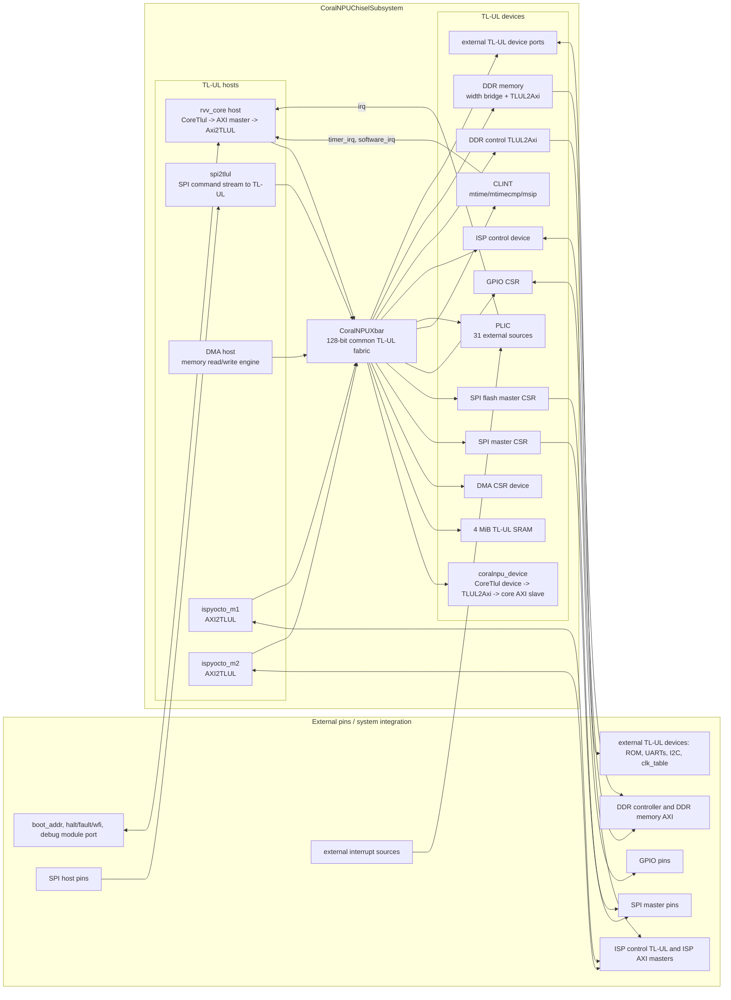
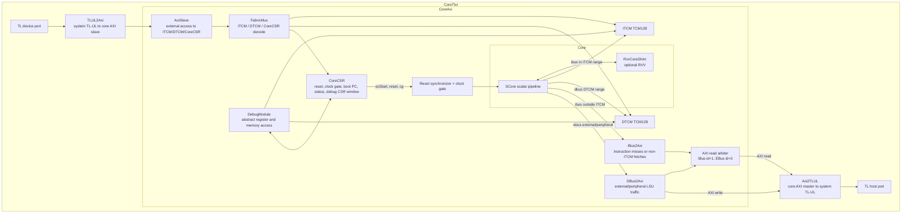
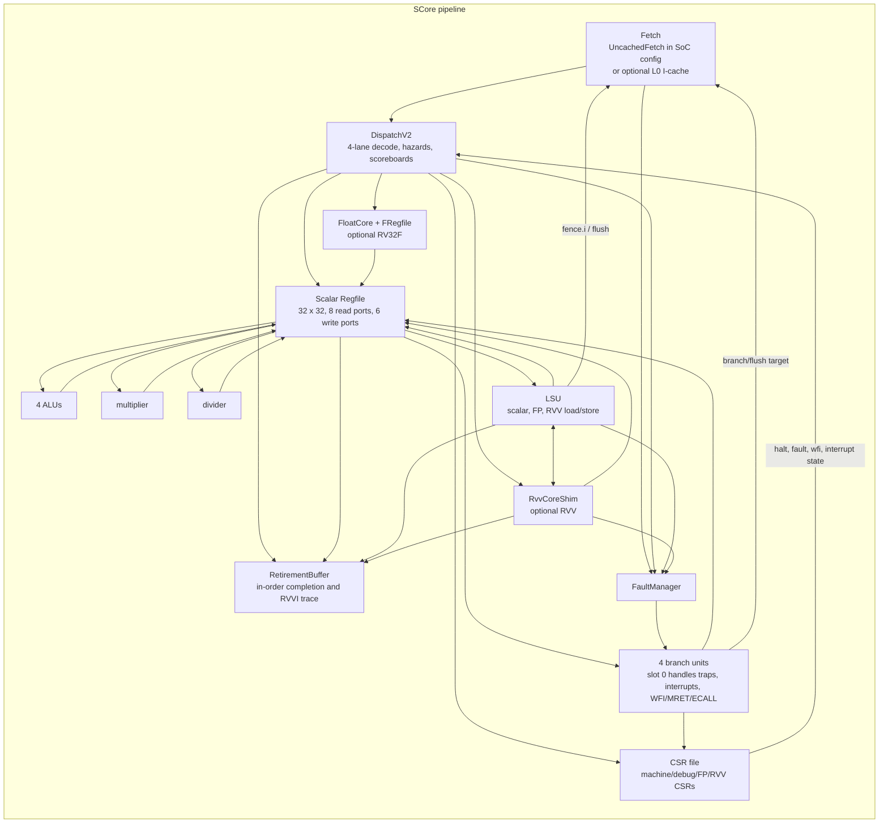

# CoralNPU Chisel System Diagram

This document summarizes the theory of operation of the Chisel hardware under `hdl/chisel`. It reflects the current Chisel subsystem, where the generated SoC contains a TL-UL crossbar, a `CoreTlul` CoralNPU core instance, local TCMs, debug/CSR access, DMA, SPI, GPIO, CLINT/PLIC interrupt blocks, internal SRAM, and special bridges to DDR and ISP-facing interfaces.

## Source Map

| Area | Primary files | Role |
| --- | --- | --- |
| SoC assembly | `src/soc/CoralNPUChiselSubsystem.scala`, `SoCChiselConfig.scala` | Top-level module generation, instance configuration, external ports, interrupt wiring, special DDR/ISP wiring |
| TL-UL crossbar | `src/soc/CoralNPUXbar.scala`, `CrossbarConfig.scala` | Host/device address map, TL-UL sockets, width conversion, clock-domain crossings, integrity wrapping |
| Core wrappers | `src/coralnpu/CoreTlul.scala`, `CoreAxi.scala`, `Core.scala` | TL-UL wrapper, AXI/local-memory wrapper, scalar plus optional RVV composition |
| Local memory/control | `TCM.scala`, `Fabric.scala`, `AxiSlave.scala`, `CoreAxiCSR.scala`, `IBus2Axi.scala`, `DBus2Axi.scala` | ITCM/DTCM SRAM access, host access to TCM/CSR/debug, external AXI master conversion |
| Scalar pipeline | `scalar/SCore.scala`, `Fetch.scala`, `UncachedFetch.scala`, `Decode.scala`, `Regfile.scala`, `Bru.scala`, `Lsu.scala`, `Csr.scala`, `FaultManager.scala` | Fetch, dispatch, scoreboarding, execution, memory, trap/interrupt/debug control |
| Optional compute extensions | `rvv/RvvCore.scala`, `rvv/RvvInterface.scala`, `float/FloatCore.scala`, `scalar/FRegfile.scala` | RVV wrapper/CSR state/LSU interface, FPNEW RV32F wrapper, FP register file |
| TL-UL peripherals | `bus/DmaEngine.scala`, `Spi2TLUL.scala`, `Spi2TLULV2.scala`, `SpiMaster.scala`, `GPIO.scala`, `Clint.scala`, `Plic.scala`, `soc/TlulSram.scala` | Memory-mapped devices and independent TL-UL hosts |

## System Diagram

## Core Diagram

## Address Map and Connectivity

The crossbar is generated from `CrossbarConfig`. Each host first enters the crossbar at its native width and clock domain, then the xbar wraps integrity, crosses to the main domain if needed, and width-converts to the common 128-bit TL-UL fabric.

| Device | Address range | Width | Clock domain | Notes |
| --- | ---: | ---: | --- | --- |
| `coralnpu_device` | default: `0x00000000-0x00001fff`, `0x00010000-0x00017fff`, `0x00030000-0x00030fff` | 128 | main | Core ITCM, DTCM, CoreCSR window through the core's TL device port |
| `coralnpu_device` | custom: `0x00000000 + ITCM`, `0x00100000 + DTCM`, `0x00200000-0x00200fff` | 128 | main | Used when ITCM/DTCM sizes differ from defaults |
| `rom` | `0x10000000-0x10007fff` | 32 | main | External TL-UL device port |
| `sram` | `0x20000000-0x203fffff` | 128 | main | Internal `TlulSram`, 4 MiB |
| `uart0` | `0x40000000-0x40000fff` | 32 | main | External TL-UL device port |
| `clk_table` | `0x40001000-0x40001fff` | 32 | main | External TL-UL device port |
| `uart1` | `0x40010000-0x40010fff` | 32 | main | External TL-UL device port |
| `spi_master` | `0x40020000-0x40020fff` | 32 | main + SPI clock | Internal SPI master CSR device with TL async FIFO to SPI clock |
| `gpio` | `0x40030000-0x40030fff` | 32 | main | Internal GPIO CSR device |
| `i2c_master` | `0x40040000-0x40040fff` | 32 | main | External TL-UL device port |
| `dma` | `0x40050000-0x40050fff` | 32 device, 128 host | main | Internal DMA CSR device plus DMA TL host |
| `spi_master_flash` | `0x40070000-0x40070fff` | 32 | main + SPI clock | Second internal SPI master |
| `clint` | `0x02000000-0x0200ffff` | 32 | main | `mtime`, `mtimecmp`, `msip`; drives core timer/software IRQs |
| `plic` | `0x0c000000-0x0fffffff` | 32 | main | 31-source interrupt controller; drives core external IRQ |
| `ispyocto_ctrl` | `0x50000000-0x500fffff` | 32 | `isp_axi_clk` | Exposed as ISP control TL-UL slave |
| `ddr_ctrl` | `0x70000000-0x70000fff` | 32 | `ddr` | TL-UL to AXI control bridge |
| `ddr_mem` | `0x80000000-0xffffffff` | 128 TL, 256 AXI | `ddr` | TL width bridge to 256-bit AXI memory port |

## Theory of Operation

### 1. Reset, boot, and clock gating

`CoreTlul` exposes active-low reset, clock, boot address, status, IRQ, and debug ports at the subsystem boundary. Internally it instantiates `CoreAxi`, which synchronizes reset through `RstSync`, captures `boot_addr` into `CoreCSR` on the first clock after reset, and uses `CoreCSR.pcStart` as CSR input 0 to seed the fetch PC.

`CoreCSR` starts with reset and clock-gate bits set. Software or an external host can write the CoreCSR window through the core's TL device port to release reset, update the start PC, read status, or issue debug-module requests. The clock gate is enabled whenever interrupts are pending, debug halt is requested, or the CSR says the core should run and the scalar core is not in WFI.

### 2. TL-UL subsystem routing

The subsystem is data-driven:

- `SoCChiselConfig` lists Chisel instances, their host/device TL-UL port names, and top-level non-TL ports.
- `CrossbarConfig` lists TL-UL hosts, devices, address ranges, widths, clock domains, and allowed host-to-device connectivity.
- `CoralNPUXbar` wraps each host and device with TL-UL integrity generation and checking, inserts `TlulFifoAsync` for non-main clock domains, and inserts `TlulWidthBridge` when a port is narrower than the 128-bit common fabric.
- Each host gets a `TlulSocket1N`; each multi-host target gets a `TlulSocketM1`. Address decode selects the target device, otherwise the socket's error responder returns a TL-UL error response.

The normal SoC hosts are the CoralNPU core, SPI-to-TL bridge, DMA engine, and two ISP AXI master ports. The normal internal targets include the core device port, SRAM, DMA CSR block, SPI masters, GPIO, CLINT, and PLIC. ROM, UART, I2C, and clock-table devices are exposed as external TL-UL ports. DDR and ISP are handled with explicit bridge wiring in the subsystem because their external interfaces are not simple same-width same-domain TL-UL ports.

### 3. Core local memory and external memory paths

`CoreTlul` is a TL-UL shell around `CoreAxi`.

- The core's outgoing AXI master is converted to TL-UL by `Axi2TLUL` and becomes xbar host `coralnpu_core`.
- The xbar's `coralnpu_device` TL-UL target is converted back to AXI by `TLUL2Axi` and enters `CoreAxi` as an AXI slave.
- `CoreAxi` converts that AXI slave traffic into a simple `FabricIO` command stream with `AxiSlave`.

Inside `CoreAxi`, ITCM, DTCM, and CoreCSR share a small local fabric:

| Path | Source | Destination | Purpose |
| --- | --- | --- | --- |
| Core instruction fetch in ITCM range | `SCore.ibus` | ITCM arbiter source 0 | One-cycle local instruction fetch from ITCM |
| Core instruction fetch outside ITCM | `SCore.ibus` | `IBus2Axi`, AXI read id 1 | Fetch from system memory such as ROM, SRAM, or DDR |
| Core load/store in DTCM range | `SCore.dbus` | DTCM arbiter source 0 | Local data TCM access |
| Core load/store to peripheral/external | `SCore.ebus` | `DBus2Axi`, AXI id 0 | System TL-UL access through the core host port |
| External host access to core-local regions | xbar `coralnpu_device` | `AxiSlave` -> `FabricMux` | Load code/data into TCM, read status, access CoreCSR/debug |
| Debug memory access | `DebugModule` | ITCM/DTCM arbiter source 2 | Abstract debug memory/register access |

The ITCM and DTCM arbiters have three sources: the scalar core, the external fabric/AXI slave path, and the debug module. `FabricMux` decodes local fabric transactions against the configured memory regions and forwards them to ITCM, DTCM, or CoreCSR.

### 4. Scalar pipeline

The scalar core (`SCore`) is a 4-lane in-order RISC-V pipeline with decoupled multi-cycle units. In the current SoC config, `enableFetchL0 = false`, so `UncachedFetch` is used. The optional `Fetch` implementation contains a 1 KiB L0 instruction cache and branch predecode, but it currently asserts a 256-bit fetch width; the SoC config uses 128-bit fetches through `UncachedFetch`.

The main pipeline stages are:

1. **Fetch:** fetch control produces sequential, branch, debug-PC, and fence.i target addresses; `InstructionBuffer` presents up to four instructions to dispatch.
2. **Dispatch:** `DispatchV2` decodes all four lanes, checks scalar/FP/RVV scoreboards, resource queue capacity, branch/jump ordering, CSR ordering, fence, single-step, WFI/mpause, and retirement-buffer space.
3. **Execute/writeback:** one-cycle ALU/BRU/CSR operations write back through lane write ports; multi-cycle MLU/DVU/LSU/FP/RVV/debug writebacks arbitrate through extra scalar write ports or the FP/vector paths.
4. **Retirement/trap ordering:** `RetirementBuffer` tracks dispatched instructions, stores, scalar/FP/vector write completions, control-flow continuity, and faults so retired debug/RVVI information is in program order.

Dispatch is conservative: a lane fires only if every earlier lane that should dispatch has fired, all scoreboards are clear for the instruction's operands, the target unit accepts the command, and no trap is pending. CSRs wait for an empty retirement buffer. Special operations that are only implemented in slot 0 are blocked in other lanes.

### 5. Control flow, exceptions, and interrupts

Each lane has a branch unit, but lane 0 also owns machine-level control effects. The first BRU handles ECALL, EBREAK, MRET, WFI, faults, and asynchronous interrupt redirection. It updates CSR state through `CsrBruIO`, writes `mepc`, `mcause`, and `mtval`, and provides the fetch redirect target.

`FaultManager` merges:

- decode faults such as illegal CSR, undefined instruction, bad JAL/JALR/Bxx alignment, and RVV dispatch faults;
- instruction access faults from fetch;
- load/store faults from the LSU/external bus;
- asynchronous RVV traps from the RVV core.

CLINT `mtip` and `msip` are wired directly to the core timer and software IRQ inputs. PLIC output is wired to the core external IRQ input. `CoreAxi` registers these IRQ inputs at the core boundary to reduce timing pressure into instruction fetch and uses them to wake the clock-gated core.

### 6. Load/store operation

`LsuV2` accepts up to four dispatch requests per cycle into a four-entry multi-enqueue circular buffer, but executes a single active slot at a time. A slot can describe scalar, floating-point, or RVV load/store work.

For each transaction, the LSU computes the target line, classifies the address against the configured memory regions, and selects exactly one bus:

| Region classification | LSU bus | Behavior |
| --- | --- | --- |
| ITCM (`IMEM`) | `ibus` | Read-only path for instruction memory loads; stores to ITCM are faulted |
| DTCM (`DMEM`) | `dbus` | Local DTCM read/write |
| Core peripheral (`Peripheral`) | `ebus` with `internal = true` | CoreCSR/internal peripheral access |
| Outside local regions | `ebus` with `internal = false` | External system memory/peripheral access through AXI/TL-UL |

Scalar loads sign/zero-extend and write the scalar regfile. FP loads return through the FP load write port. Vector loads/stores exchange data with the RVV core through `lsu2rvv` and `rvv2lsu`, and vector stores report completion to the retirement buffer when the RVV handshake marks the last micro-op.

Fence and flush operations are represented as LSU commands. `fence.i` drives the instruction flush path and a next PC; data flush commands drive the external `dflush` interface. In `CoreAxi` these flush-ready signals are tied high because the local TCM path has no cache to flush.

### 7. FP and RVV extensions

When enabled, the FP path consists of an `FRegfile`, `FloatCore`, CSR FP flags and rounding mode, and LSU FP load/store integration. `FloatCore` wraps the CVFPU `fpnew_top` RV32F implementation and maps decoded RISC-V FP operations to FPNEW operation, modifier, rounding, operands, result, and status signals. The FP register file has three read ports and two write ports; the second write port arbitrates LSU FP loads and RVV scalar-FP writeback.

When enabled, RVV is wrapped by `RvvCoreShim`. The scalar dispatch stage sends compressed RVV instructions on four decoupled lanes. The shim exposes scalar source operands, vector load/store handshakes, asynchronous scalar and FP writebacks, trap output, queue capacity, and RVV CSR/config state. The shim also keeps `vstart`, `vxrm`, and `vxsat` coherent between CSR writes and updates reported by the RVV core.

### 8. Peripheral behavior

| Block | Operation |
| --- | --- |
| `Spi2TLUL` / `Spi2TLULV2` | External SPI slave interface parses operation/address/length frames in the SPI clock domain, crosses descriptors and data through async queues, and emits 128-bit TL-UL transactions in the system clock domain. |
| `SpiMaster` | Memory-mapped SPI controller with control/status/TX/RX/CS registers, TX/RX FIFOs, programmable divider, CPOL/CPHA, manual/auto chip select, and an async TL-UL FIFO into the SPI clock domain. |
| `DmaEngine` | TL-UL CSR device plus TL-UL host. Software writes control and descriptor address, then the engine fetches descriptors, optionally polls, transfers data from source to destination, follows descriptor chains, and records status/error codes. |
| `GPIO` | Simple TL-UL CSR block with input read, output data, and output-enable registers. |
| `CLINT` | Implements `msip`, `mtime`, and `mtimecmp`; drives software and timer interrupts. |
| `PLIC` | Implements priority, pending, level/edge, enable, threshold, claim/complete; selects highest-priority enabled pending interrupt. |
| `TlulSram` | TL-UL to 128-bit SRAM adapter around `Sram_Nx128`, used as the internal 4 MiB SRAM. |

## End-to-End Transaction Examples

| Scenario | Flow |
| --- | --- |
| Boot/core release | External host writes CoreCSR reset/control through `coralnpu_device`; `CoreCSR` releases core reset and supplies `pcStart` from captured `boot_addr` or the programmed start PC. |
| Instruction fetch from ITCM | `Fetch/UncachedFetch` issues `ibus`; `CoreAxi` sees address in IMEM; ITCM arbiter source 0 reads `TCM128`; data returns directly to fetch. |
| Instruction fetch from ROM/DDR/SRAM | `ibus` address misses ITCM; `IBus2Axi` emits AXI read id 1; read arbiter sends through `Axi2TLUL`; xbar decodes to ROM/SRAM/DDR; read data returns by id to `IBus2Axi`. |
| Scalar load from DTCM | Dispatch issues LSU command; LSU classifies address as DMEM; `dbus` reads DTCM; LSU formats the word/byte/halfword and writes scalar regfile through the LSU write port. |
| Store to external peripheral | LSU classifies address outside local memory; `ebus` feeds `DBus2Axi`; `CoreTlul` converts AXI write to TL-UL; xbar routes to the addressed peripheral. |
| DMA copy | Core programs DMA CSR device; DMA host fetches descriptors and moves data through the xbar without scalar LSU involvement. |
| External SPI writes memory | SPI pins feed `Spi2TLUL`; parsed command/data cross to system clock; xbar routes TL-UL writes to SRAM, DDR, or core-local memory. |
| Interrupt entry | CLINT or PLIC asserts IRQ; `CoreAxi` registers it and ungates the clock; lane-0 BRU observes CSR interrupt state, writes trap CSRs, redirects fetch to `mtvec`. |
| Debug register access | External debug port or CoreCSR debug registers arbitrate into `DebugModule`; responses return to the selected source; debug memory accesses use dedicated ITCM/DTCM arbiter ports. |

## Important Configuration Notes

- Default core-local regions are 8 KiB ITCM at `0x00000000`, 32 KiB DTCM at `0x00010000`, and a 4 KiB core peripheral/CSR window at `0x00030000`.
- Custom ITCM/DTCM sizes move DTCM to `0x00100000` and the core CSR window to `0x00200000` to leave room for up to 1 MiB local memories.
- The SoC core instance enables RVV and FP, uses 128-bit TL-UL/LSU/fetch data paths, and disables the L0 fetch cache.
- The common crossbar fabric is 128-bit TL-UL. Narrow hosts/devices are bridged; DDR memory is widened to a 256-bit AXI port after the xbar.
- `enableVerification` controls `useRetirementBuffer`; when false, the retirement buffer is built in mini mode but still supplies ordering/trap control signals needed by dispatch and debug.
